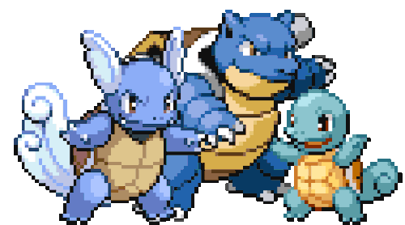

  <samp>
    <b>
      バックエンド
    </b>
       
      Hi there! I'm José Venâncio
       
  </samp>

   

  

 

  
  

      <samp>
        <b>More Info</b>
      </samp>
  

  
   

  
  
   
   
  
   
   
  

 
  
  
  
  
  
  
  
  
  

 

##

  <samp>
    <b>
      Contact me:
    </b>
  </samp>
   
   

  
  
  
  

##

 
 

